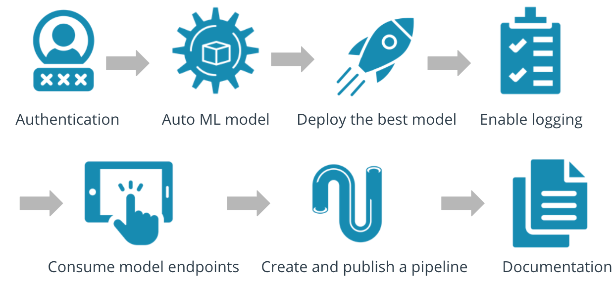

_NOTE:_ This file is a template that you can use to create the README for your project. The _TODO_ comments below will highlight the information you should be sure to include sneha.

# Operationalizing The Machine Learning Model In Azure

The objective of this project is to build a machine learning model using Azure Container Services.We are provided with the banking dataset. The main steps to be followed to perform project are as follows:-

1) Authentication
2) Automated ML Experiment
3) Deploy the best model
4) Enable logging
5) Swagger Documentation
6) Consume model endpoints
7) Create and publish a pipeline
9) Documentation

## Architectural Diagram

_TODO_: Provide an architectual diagram of the project and give an introduction of each step. An architectural diagram is an image that helps visualize the flow of operations from start to finish. In this case, it has to be related to the completed project, with its various stages that are critical to the overall flow. For example, one stage for managing models could be "using Automated ML to determine the best model".

## Key Steps

_TODO_: Write a short discription of the key steps. Remeber to include all the screenshots required to demonstrate key steps.

## Screen Recording

_TODO_ Provide a link to a screen recording of the project in action. Remember that the screencast should demonstrate:

## Standout Suggestions

_TODO (Optional):_ This is where you can provide information about any standout suggestions that you have attempted.
